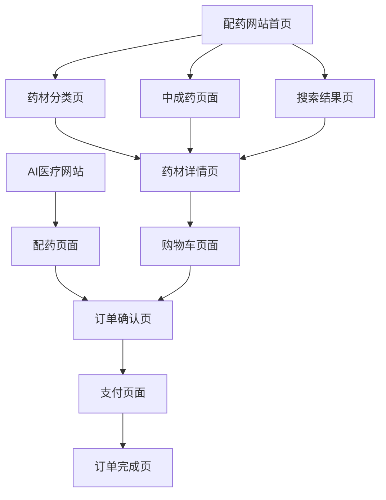

# 中药在线配药网站产品需求文档

## 1. 产品概述

中药在线配药网站是一个独立的电商平台，专注于中药药材和中成药的在线销售与配药服务。该网站与AI医疗诊断系统形成完整的商业闭环，用户在获得AI诊断报告后可直接跳转到配药网站完成药材采购。

- 主要目的：为AI医疗诊断用户提供便捷的中药配药服务，实现从诊断到治疗的完整闭环
- 目标用户：AI医疗诊断系统的用户、中医药爱好者、需要中药治疗的患者
- 商业价值：通过AI诊断引流，提供中药配药服务，形成可持续的商业模式

## 2. 核心功能

### 2.1 用户角色

| 角色 | 注册方式 | 核心权限 |
|------|----------|----------|
| 普通用户 | 从AI医疗网站跳转自动登录 | 浏览药材、下单购买、查看订单 |
| 注册用户 | 手机号/邮箱注册 | 完整购物功能、收藏、评价、积分 |

### 2.2 功能模块

我们的中药配药网站包含以下主要页面：

1. **首页**：网站导航、热门药材展示、中成药推荐、搜索功能
2. **药材分类页**：按功效分类的药材展示、筛选功能
3. **药材详情页**：药材详细信息、功效介绍、价格、购买选项
4. **配药页面**：AI诊断跳转页面、自动填充药方、价格计算
5. **购物车页面**：商品管理、数量调整、优惠券使用
6. **订单确认页**：地址选择、配送方式、煎药服务选择
7. **支付页面**：微信支付、支付宝支付选择
8. **订单完成页**：订单信息确认、物流跟踪

### 2.3 页面详情

| 页面名称 | 模块名称 | 功能描述 |
|----------|----------|----------|
| 首页 | 导航栏 | 网站logo、主导航菜单、用户登录状态、购物车图标 |
| 首页 | 轮播图 | 展示热门药材、促销活动、中医养生知识 |
| 首页 | 药材分类 | 按功效分类展示（清热解毒、补气养血、健脾胃等） |
| 首页 | 热门推荐 | 热销药材、中成药推荐、用户评价展示 |
| 药材分类页 | 筛选器 | 按价格、功效、产地、品牌筛选药材 |
| 药材分类页 | 商品列表 | 网格布局展示药材，包含图片、名称、价格、规格 |
| 药材详情页 | 商品信息 | 药材图片、名称、价格、规格、库存状态 |
| 药材详情页 | 功效介绍 | 药材功效、使用方法、注意事项、配伍禁忌 |
| 药材详情页 | 购买选项 | 数量选择、规格选择、加入购物车、立即购买 |
| 配药页面 | AI药方信息 | 显示从AI诊断传递的药方信息（治则、方名、组成） |
| 配药页面 | 药材清单 | 自动填充的药材列表，显示名称、剂量、单价、小计 |
| 配药页面 | 服务选项 | 煎药服务选择、代煎费用、配送方式选择 |
| 配药页面 | 价格计算 | 药材费用、煎药费用、配送费用、总计金额 |
| 购物车页面 | 商品管理 | 商品列表、数量调整、删除商品、批量操作 |
| 购物车页面 | 优惠信息 | 优惠券选择、满减活动、积分抵扣 |
| 订单确认页 | 地址管理 | 收货地址选择、新增地址、地址编辑 |
| 订单确认页 | 配送选项 | 配送方式选择、配送时间、特殊要求 |
| 订单确认页 | 订单摘要 | 商品清单、费用明细、支付金额确认 |
| 支付页面 | 支付方式 | 微信支付、支付宝支付选择界面 |
| 支付页面 | 订单信息 | 订单号、支付金额、商品摘要 |
| 订单完成页 | 订单确认 | 订单号、支付状态、预计发货时间 |
| 订单完成页 | 后续服务 | 物流跟踪、客服联系、订单评价 |

## 3. 核心流程

### 3.1 AI诊断引流流程

用户在AI医疗网站完成诊断后，在治疗方案部分点击"马上配药"按钮，系统自动携带药方参数跳转到配药网站，模拟登录状态，直接进入配药页面，显示已选择的药材和剂量。

### 3.2 独立购物流程

用户直接访问配药网站，浏览药材分类，查看药材详情，选择规格和数量，加入购物车，确认订单，选择配送和煎药服务，填写地址，选择支付方式，完成购买。

### 3.3 页面导航流程图



## 4. 用户界面设计

### 4.1 设计风格

- **主色调**：深绿色(#2D5016)和金黄色(#DAA520)，体现中医药传统文化
- **辅助色**：浅绿色(#90EE90)和米白色(#F5F5DC)
- **按钮样式**：圆角矩形，渐变效果，悬停状态变化
- **字体**：思源黑体，标题18-24px，正文14-16px
- **布局风格**：卡片式布局，网格排列，响应式设计
- **图标风格**：线性图标，中医药元素（如草药、药罐等）

### 4.2 页面设计概览

| 页面名称 | 模块名称 | UI元素 |
|----------|----------|--------|
| 首页 | 导航栏 | 深绿色背景，白色文字，logo居左，导航居中，用户信息居右 |
| 首页 | 轮播图 | 高度400px，自动轮播，圆点指示器，渐变遮罩文字 |
| 首页 | 药材分类 | 6列网格布局，圆形图标，分类名称，悬停效果 |
| 首页 | 热门推荐 | 4列商品卡片，药材图片，名称价格，评分星级 |
| 配药页面 | AI药方信息 | 浅绿色背景卡片，标题突出，内容清晰分层 |
| 配药页面 | 药材清单 | 表格布局，斑马纹背景，价格右对齐，总计突出显示 |
| 配药页面 | 服务选项 | 单选按钮组，价格标签，说明文字，选中状态高亮 |
| 购物车页面 | 商品列表 | 横向卡片布局，商品图片左侧，信息居中，操作按钮右侧 |
| 支付页面 | 支付方式 | 大图标按钮，微信绿色，支付宝蓝色，选中状态边框 |

### 4.3 响应式设计

网站采用移动端优先的响应式设计，支持桌面端、平板端和移动端访问。移动端优化触摸操作，按钮尺寸不小于44px，支持手势滑动和缩放。

## 5. 与主站集成方案

### 5.1 跳转参数设计

从AI医疗网站跳转时，URL携带以下参数：
- `prescription`：药方信息（Base64编码）
- `user_token`：用户身份令牌
- `source`：来源标识

### 5.2 数据传递格式

```json
{
  "treatmentPlan": {
    "principle": "滋阴降火，润肺利咽",
    "formulaName": "百合固金汤合养阴清肺汤加减",
    "ingredients": [
      {"name": "生地", "dosage": "15g", "price": 0.8},
      {"name": "麦冬", "dosage": "12g", "price": 1.2},
      {"name": "玄参", "dosage": "12g", "price": 0.6}
    ],
    "instructions": "每日1剂，水煎30分钟，取汁300ml，分早晚两次温服"
  }
}
```

### 5.3 部署架构

配药网站作为独立模块部署，支持以下访问方式：
- 二级域名：`pharmacy.demo-doctor.vercel.app`
- 二级路径：`demo-doctor.vercel.app/pharmacy`

通过Vercel的路由配置实现统一部署和独立访问。