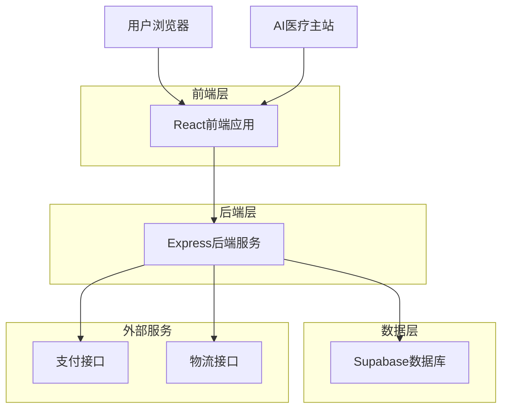
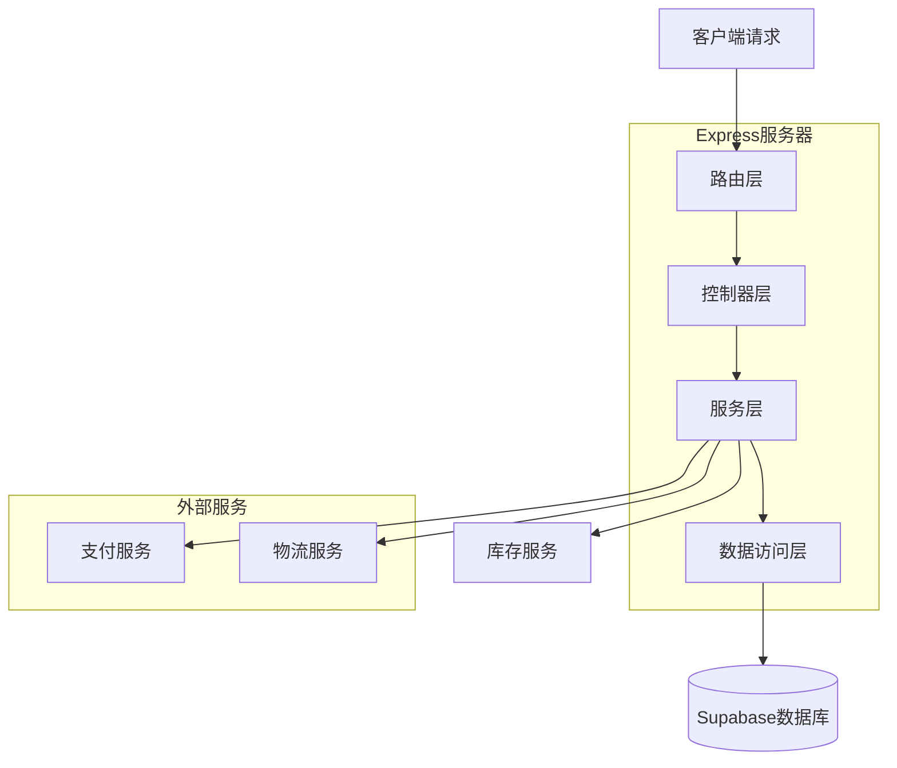
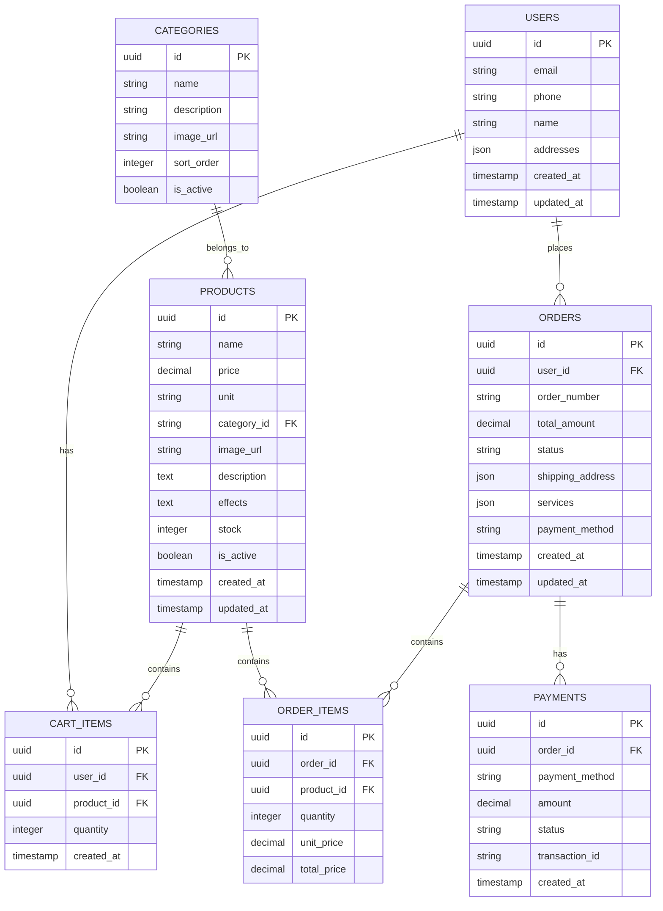

# 中药配药网站技术架构文档

## 1. 架构设计



## 2. 技术描述

* 前端：React\@18 + TypeScript + Tailwind CSS + Vite

* 后端：Express\@4 + TypeScript

* 数据库：Supabase (PostgreSQL)

* 状态管理：Zustand

* 路由：React Router\@6

* UI组件：Headless UI + 自定义组件

* 支付：微信支付API + 支付宝API（模拟）

* 部署：Vercel

## 3. 路由定义

| 路由                      | 用途                   |
| ----------------------- | -------------------- |
| /pharmacy               | 配药网站首页，展示药材分类和热门推荐   |
| /pharmacy/category/:id  | 药材分类页面，按功效分类展示药材     |
| /pharmacy/product/:id   | 药材详情页面，显示药材详细信息和购买选项 |
| /pharmacy/prescription  | AI诊断跳转的配药页面，自动填充药方信息 |
| /pharmacy/cart          | 购物车页面，管理选购的药材        |
| /pharmacy/checkout      | 订单确认页面，填写地址和选择服务     |
| /pharmacy/payment       | 支付页面，选择支付方式          |
| /pharmacy/order-success | 订单完成页面，显示订单信息        |
| /pharmacy/orders        | 订单列表页面，查看历史订单        |

## 4. API定义

### 4.1 核心API

**药材相关接口**

```
GET /api/pharmacy/products
```

请求参数：

| 参数名      | 参数类型   | 是否必需  | 描述        |
| -------- | ------ | ----- | --------- |
| category | string | false | 药材分类ID    |
| page     | number | false | 页码，默认1    |
| limit    | number | false | 每页数量，默认20 |
| search   | string | false | 搜索关键词     |

响应：

| 参数名      | 参数类型   | 描述   |
| -------- | ------ | ---- |
| products | array  | 药材列表 |
| total    | number | 总数量  |
| page     | number | 当前页码 |

示例：

```json
{
  "products": [
    {
      "id": "1",
      "name": "生地黄",
      "price": 0.8,
      "unit": "g",
      "category": "补血药",
      "image": "/images/shengdi.jpg",
      "description": "滋阴补血，生津润燥",
      "stock": 1000
    }
  ],
  "total": 150,
  "page": 1
}
```

**处方配药接口**

```
POST /api/pharmacy/prescription
```

请求：

| 参数名          | 参数类型   | 是否必需 | 描述            |
| ------------ | ------ | ---- | ------------- |
| prescription | string | true | Base64编码的处方信息 |
| user\_token  | string | true | 用户身份令牌        |

响应：

| 参数名         | 参数类型    | 描述    |
| ----------- | ------- | ----- |
| ingredients | array   | 药材清单  |
| totalPrice  | number  | 总价格   |
| available   | boolean | 是否有库存 |

**订单相关接口**

```
POST /api/pharmacy/orders
```

请求：

| 参数名             | 参数类型   | 是否必需  | 描述        |
| --------------- | ------ | ----- | --------- |
| items           | array  | true  | 订单商品列表    |
| address         | object | true  | 收货地址      |
| services        | object | false | 附加服务（煎药等） |
| payment\_method | string | true  | 支付方式      |

响应：

| 参数名           | 参数类型   | 描述   |
| ------------- | ------ | ---- |
| order\_id     | string | 订单ID |
| payment\_url  | string | 支付链接 |
| total\_amount | number | 支付金额 |

## 5. 服务器架构图



## 6. 数据模型

### 6.1 数据模型定义



### 6.2 数据定义语言

**药材表 (products)**

```sql
-- 创建药材表
CREATE TABLE products (
    id UUID PRIMARY KEY DEFAULT gen_random_uuid(),
    name VARCHAR(100) NOT NULL,
    price DECIMAL(10,2) NOT NULL,
    unit VARCHAR(10) DEFAULT 'g',
    category_id UUID REFERENCES categories(id),
    image_url TEXT,
    description TEXT,
    effects TEXT,
    stock INTEGER DEFAULT 0,
    is_active BOOLEAN DEFAULT true,
    created_at TIMESTAMP WITH TIME ZONE DEFAULT NOW(),
    updated_at TIMESTAMP WITH TIME ZONE DEFAULT NOW()
);

-- 创建索引
CREATE INDEX idx_products_category ON products(category_id);
CREATE INDEX idx_products_name ON products(name);
CREATE INDEX idx_products_active ON products(is_active);

-- 初始化数据
INSERT INTO categories (id, name, description) VALUES 
('cat_001', '补血药', '具有补血作用的中药'),
('cat_002', '清热药', '具有清热解毒作用的中药'),
('cat_003', '健脾药', '具有健脾益气作用的中药');

INSERT INTO products (name, price, category_id, description, effects, stock) VALUES 
('生地黄', 0.80, 'cat_001', '玄参科植物地黄的新鲜或干燥块根', '滋阴补血，生津润燥', 1000),
('麦冬', 1.20, 'cat_001', '百合科植物麦冬的干燥块根', '养阴润肺，清心除烦', 800),
('玄参', 0.60, 'cat_002', '玄参科植物玄参的干燥根', '清热凉血，滋阴降火', 600),
('百合', 2.50, 'cat_001', '百合科植物百合的干燥肉质鳞叶', '养阴润肺，清心安神', 400),
('白芍', 1.80, 'cat_001', '毛茛科植物芍药的干燥根', '养血调经，敛阴止汗', 700);
```

**订单表 (orders)**

```sql
-- 创建订单表
CREATE TABLE orders (
    id UUID PRIMARY KEY DEFAULT gen_random_uuid(),
    user_id UUID,
    order_number VARCHAR(50) UNIQUE NOT NULL,
    total_amount DECIMAL(10,2) NOT NULL,
    status VARCHAR(20) DEFAULT 'pending',
    shipping_address JSONB,
    services JSONB,
    payment_method VARCHAR(20),
    created_at TIMESTAMP WITH TIME ZONE DEFAULT NOW(),
    updated_at TIMESTAMP WITH TIME ZONE DEFAULT NOW()
);

-- 创建索引
CREATE INDEX idx_orders_user_id ON orders(user_id);
CREATE INDEX idx_orders_status ON orders(status);
CREATE INDEX idx_orders_created_at ON orders(created_at DESC);

-- 创建订单商品表
CREATE TABLE order_items (
    id UUID PRIMARY KEY DEFAULT gen_random_uuid(),
    order_id UUID REFERENCES orders(id) ON DELETE CASCADE,
    product_id UUID REFERENCES products(id),
    quantity INTEGER NOT NULL,
    unit_price DECIMAL(10,2) NOT NULL,
    total_price DECIMAL(10,2) NOT NULL
);
```

**购物车表 (cart\_items)**

```sql
-- 创建购物车表
CREATE TABLE cart_items (
    id UUID PRIMARY KEY DEFAULT gen_random_uuid(),
    user_id UUID NOT NULL,
    product_id UUID REFERENCES products(id) ON DELETE CASCADE,
    quantity INTEGER NOT NULL DEFAULT 1,
    created_at TIMESTAMP WITH TIME ZONE DEFAULT NOW()
);

-- 创建唯一索引防止重复
CREATE UNIQUE INDEX idx_cart_user_product ON cart_items(user_id, product_id);
```

## 7. 与主站集成技术方案

### 7.1 跳转参数处理

```typescript
// 处理AI医疗网站跳转参数
interface PrescriptionParams {
  prescription: string; // Base64编码的处方信息
  user_token: string;   // 用户身份令牌
  source: string;       // 来源标识
}

// 解析处方信息
function parsePrescription(encodedData: string) {
  const decoded = atob(encodedData);
  return JSON.parse(decoded);
}
```

### 7.2 路由配置

```javascript
// vercel.json 路由配置
{
  "routes": [
    {
      "src": "/pharmacy/(.*)",
      "dest": "/pharmacy/index.html"
    },
    {
      "src": "/api/pharmacy/(.*)",
      "dest": "/api/pharmacy/$1"
    }
  ]
}
```

### 7.3 部署配置

配药网站作为独立模块部署，支持：

* 独立域名访问

* 与主站共享用户认证

* 独立的数据库表结构

* 统一的部署和监控

