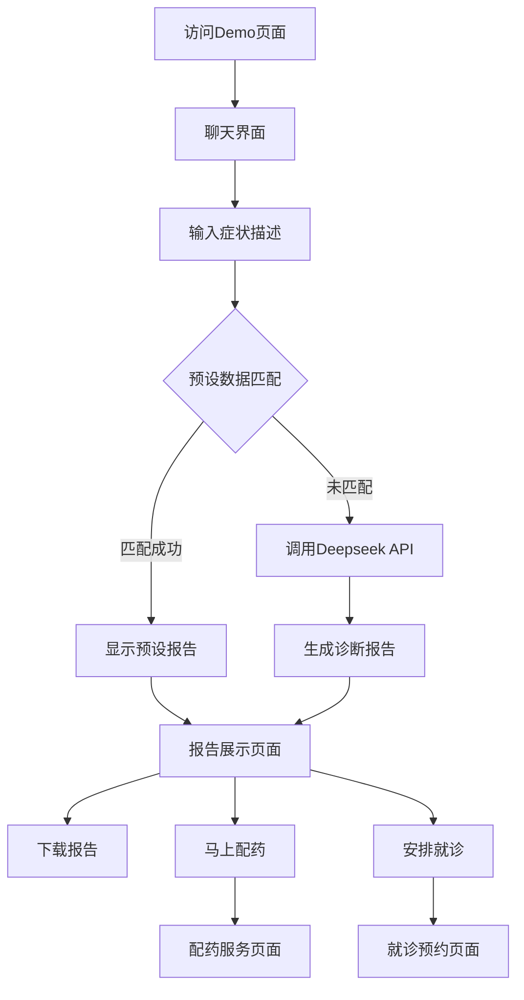

## 1. 产品概述

AI医疗演示Demo是一个专注于中医垂直领域的智能诊断平台，旨在向投资者和客户展示AI技术在中医领域的应用潜力。该Demo通过模拟智能诊断流程，展示如何利用AI实现国内医疗能力的知识下沉和全球普惠，同时为后续的配药和就诊服务导流。

## 2. 核心功能

### 2.1 用户角色

本Demo面向演示场景，无需复杂的用户角色区分，所有访问者均可直接使用核心功能。

### 2.2 功能模块

我们的AI中医诊断Demo包含以下主要页面：
1. **主诊断页面**：聊天界面、症状输入、智能诊断、报告展示
2. **配药引导页面**：展示配药服务信息和联系方式
3. **就诊预约页面**：展示就诊预约服务和联系方式

### 2.3 页面详情

| 页面名称 | 模块名称 | 功能描述 |
|---------|---------|----------|
| 主诊断页面 | 聊天界面 | 提供类似Deepseek的聊天界面，包含输入框、对话历史显示区域 |
| 主诊断页面 | 多模态输入入口 | 显示"上传文档"和"上传图片"按钮（Demo阶段仅展示，不实际处理） |
| 主诊断页面 | 智能诊断引擎 | 优先匹配预设数据，未命中时调用Deepseek API生成诊断报告 |
| 主诊断页面 | 报告展示 | 以Markdown格式渲染显示中医诊断报告，包含四诊信息、辨证分析、治疗方案等 |
| 主诊断页面 | 引导按钮 | 提供"马上配药"和"安排就诊"按钮，引导用户到后续服务 |
| 主诊断页面 | 报告下载 | 支持将诊断报告下载为PDF或Markdown文件 |
| 主诊断页面 | 多语言切换 | 支持中文、英文、日文三种语言切换 |
| 配药引导页面 | 服务介绍 | 展示配药服务的优势和流程说明 |
| 配药引导页面 | 联系方式 | 提供配药服务的联系方式和咨询入口 |
| 就诊预约页面 | 服务介绍 | 展示就诊预约服务的优势和专家团队 |
| 就诊预约页面 | 预约入口 | 提供就诊预约的联系方式和预约流程 |

## 3. 核心流程

**主要用户操作流程：**

1. 用户访问Demo页面，看到聊天界面
2. 用户在输入框中描述症状（如："我最近总是失眠多梦，口干舌燥，脾气也比较大"）
3. 系统首先尝试匹配预设的演示数据
4. 如果匹配成功，直接显示预设的诊断报告
5. 如果未匹配，调用Deepseek API生成诊断报告
6. 用户查看完整的中医诊断报告
7. 用户可选择下载报告、点击配药按钮或就诊按钮
8. 用户可随时切换界面语言

## 4. 用户界面设计

### 4.1 设计风格

- **主色调**：医疗蓝（#2E86AB）和中医绿（#A23B72）
- **辅助色**：温暖白（#F8F9FA）、深灰（#343A40）
- **按钮样式**：圆角矩形，具有轻微阴影效果
- **字体**：中文使用思源黑体，英文使用Roboto，日文使用Noto Sans JP
- **字体大小**：标题18px，正文14px，小字12px
- **布局风格**：卡片式设计，顶部导航栏，响应式布局
- **图标风格**：线性图标，简洁现代

### 4.2 页面设计概览

| 页面名称 | 模块名称 | UI元素 |
|---------|---------|--------|
| 主诊断页面 | 顶部导航 | Logo、语言切换按钮（中/EN/日）、简洁的导航菜单 |
| 主诊断页面 | 聊天区域 | 白色背景，消息气泡（用户：右侧蓝色，系统：左侧灰色），滚动条 |
| 主诊断页面 | 输入区域 | 底部固定，输入框+发送按钮，上传按钮（文档/图片图标） |
| 主诊断页面 | 报告展示 | Markdown渲染，清晰的层级结构，专业的医疗报告样式 |
| 主诊断页面 | 操作按钮 | "马上配药"（绿色）、"安排就诊"（蓝色）、"下载报告"（灰色）按钮 |
| 配药引导页面 | 服务卡片 | 图标+标题+描述的卡片布局，突出配药服务优势 |
| 就诊预约页面 | 专家展示 | 专家头像+简介的网格布局，体现专业性 |

### 4.3 响应式设计

产品采用移动优先的响应式设计，重点适配PC端Chrome浏览器和移动端Safari浏览器。在移动端，聊天界面将占据全屏，输入框固定在底部，确保良好的触屏交互体验。