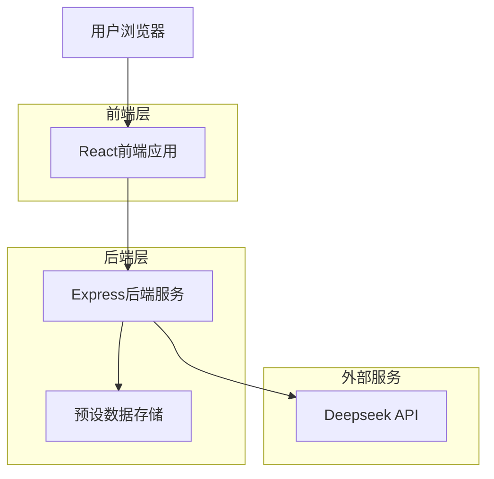
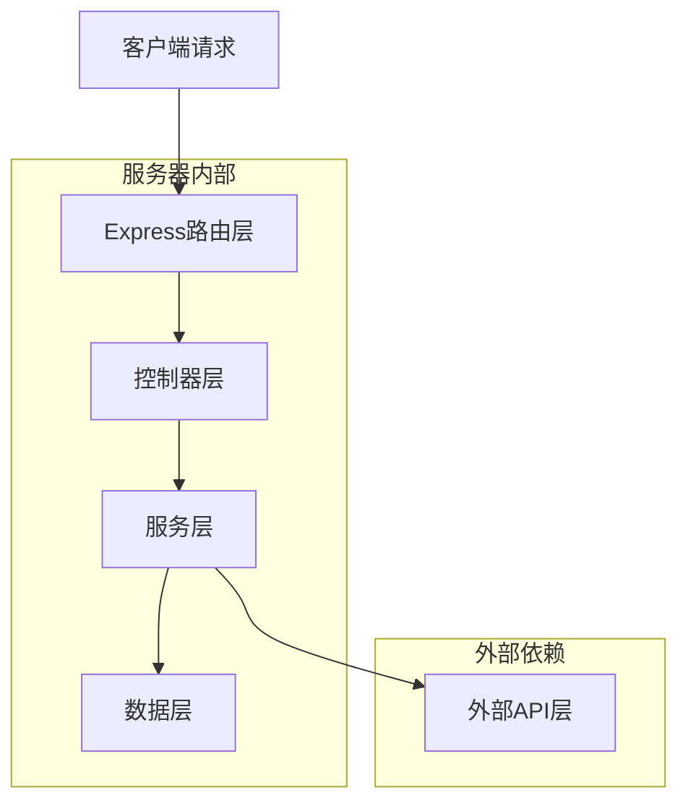

## 1. 架构设计



## 2. 技术描述

* **前端**: React\@18 + TypeScript + Tailwind CSS + Vite

* **后端**: Express\@4 + TypeScript + Node.js

* **外部服务**: Deepseek API

* **部署**: Vercel (前端) + Vercel Serverless Functions (后端)

## 3. 路由定义

| 路由           | 用途                |
| ------------ | ----------------- |
| /            | 主诊断页面，包含聊天界面和诊断功能 |
| /pharmacy    | 配药服务引导页面          |
| /appointment | 就诊预约引导页面          |

## 4. API定义

### 4.1 核心API

**智能诊断接口**

```
POST /api/diagnosis
```

请求参数:

| 参数名      | 参数类型   | 是否必需  | 描述                   |
| -------- | ------ | ----- | -------------------- |
| input    | string | true  | 用户输入的症状描述            |
| language | string | false | 语言代码 (zh/en/ja)，默认zh |

响应参数:

| 参数名         | 参数类型    | 描述                |
| ----------- | ------- | ----------------- |
| success     | boolean | 请求是否成功            |
| data        | object  | 诊断结果数据            |
| data.report | string  | Markdown格式的诊断报告   |
| data.source | string  | 数据来源 (preset/api) |

请求示例:

```json
{
  "input": "我最近总是失眠多梦，口干舌燥，脾气也比较大",
  "language": "zh"
}
```

响应示例:

```json
{
  "success": true,
  "data": {
    "report": "## 关于患者的中医诊断与调理方案\n\n### 一、四诊信息汇总...",
    "source": "preset"
  }
}
```

**报告下载接口**

```
POST /api/download-report
```

请求参数:

| 参数名    | 参数类型   | 是否必需  | 描述                  |
| ------ | ------ | ----- | ------------------- |
| report | string | true  | Markdown格式的报告内容     |
| format | string | false | 下载格式 (pdf/md)，默认pdf |

响应: 返回文件流

## 5. 服务器架构图



## 6. 数据模型

### 6.1 预设数据结构

```typescript
interface PresetData {
  id: string;
  input: string;           // 用户输入的症状描述
  keywords: string[];      // 关键词数组，用于匹配
  report: {
    zh: string;           // 中文报告
    en: string;           // 英文报告
    ja: string;           // 日文报告
  };
  createdAt: Date;
}
```

### 6.2 API请求/响应类型

```typescript
// 诊断请求
interface DiagnosisRequest {
  input: string;
  language?: 'zh' | 'en' | 'ja';
}

// 诊断响应
interface DiagnosisResponse {
  success: boolean;
  data?: {
    report: string;
    source: 'preset' | 'api';
  };
  error?: string;
}

// Deepseek API配置
interface DeepseekConfig {
  apiKey: string;
  baseUrl: string;
  model: string;
  maxTokens: number;
}
```

### 6.3 预设数据示例

```json
[
  {
    "id": "case_001",
    "input": "失眠多梦，口干舌燥，脾气大",
    "keywords": ["失眠", "多梦", "口干", "舌燥", "脾气", "烦躁"],
    "report": {
      "zh": "## 关于患者的中医诊断与调理方案\n\n### 一、四诊信息汇总\n- 主诉：失眠多梦，口干舌燥，脾气烦躁，持续2周\n- 望诊：舌红，苔薄黄\n- 问诊：\n  - 寒热：无明显寒热\n  - 汗出：夜间盗汗\n  - 睡眠：入睡困难，多梦易醒\n  - 情绪：烦躁易怒\n\n### 二、特征分析与辨证\n- 核心病机分析：患者因长期压力，导致肝的功能失调，表现为气机郁结，进而影响心神，形成肝郁化火之证。\n- 证型诊断：肝郁化火证\n\n### 三、诊断结论\n- 病名（中医）：不寐\n- 证型（中医）：肝郁化火证\n\n### 四、治疗方案\n- 治则：疏肝解郁，清热安神\n- 药方：\n  - 方名：甘麦大枣汤加减\n  - 组成与剂量：\n    - 甘草 6g（调和诸药）\n    - 小麦 30g（养心安神）\n    - 大枣 10枚（补脾益气）\n    - 柴胡 9g（疏肝解郁）\n    - 黄连 3g（清热泻火）\n    - 酸枣仁 15g（养心安神）\n  - 煎服方法：每日一剂，水煎分两次温服。忌生冷油腻。\n\n### 五、生活调养建议\n- 饮食建议：\n  - 宜食：莲子、百合、银耳等清热安神之品\n  - 忌食：辛辣刺激、咖啡、浓茶等\n- 情志调理：保持心情舒畅，可尝试冥想、深呼吸\n- 起居运动：规律作息，晚上10点前入睡\n- 穴位保健：按揉神门穴、三阴交穴各5分钟\n\n---\n> 免责声明：本诊断报告由AI生成，仅供参考，不能替代专业医师诊疗。",
      "en": "## TCM Diagnosis and Treatment Plan\n\n### I. Four Diagnostic Methods Summary\n- Chief Complaint: Insomnia, dry mouth, irritability for 2 weeks\n- Inspection: Red tongue with thin yellow coating\n- Inquiry: Night sweats, difficulty falling asleep, vivid dreams, irritability\n\n### II. Pattern Analysis\n- Core Pathogenesis: Liver qi stagnation transforming into fire\n- Pattern Diagnosis: Liver qi stagnation with heat\n\n### III. Diagnosis\n- Disease: Insomnia\n- Pattern: Liver qi stagnation with heat\n\n### IV. Treatment Plan\n- Treatment Principle: Soothe liver, clear heat, calm spirit\n- Herbal Formula: Modified Gan Mai Da Zao Tang\n\n### V. Lifestyle Recommendations\n- Diet: Lotus seeds, lily bulbs, white fungus\n- Avoid: Spicy foods, coffee, strong tea\n- Sleep: Regular schedule, sleep before 10 PM\n\n---\n> Disclaimer: This AI-generated report is for reference only.",
      "ja": "## 中医診断・治療プラン\n\n### 一、四診情報\n- 主訴：不眠、多夢、口渇、イライラ（2週間持続）\n- 望診：舌紅、苔薄黄\n- 問診：寝汗、入眠困難、多夢、イライラ\n\n### 二、弁証分析\n- 病機：肝気鬱結化火\n- 証型：肝鬱化火証\n\n### 三、診断\n- 病名：不眠\n- 証型：肝鬱化火証\n\n### 四、治療方案\n- 治則：疏肝解鬱、清熱安神\n- 処方：甘麦大棗湯加減\n\n### 五、生活指導\n- 食事：蓮子、百合、白木耳など\n- 禁忌：辛い物、コーヒー、濃茶\n- 睡眠：規則正しい生活、22時前就寝\n\n---\n> 免責事項：このAI診断は参考用です。"
    },
    "createdAt": "2024-01-01T00:00:00Z"
  }
]
```

## 7. 部署配置

### 7.1 Vercel部署配置

**vercel.json**

```json
{
  "version": 2,
  "builds": [
    {
      "src": "frontend/package.json",
      "use": "@vercel/static-build",
      "config": {
        "distDir": "dist"
      }
    },
    {
      "src": "api/**/*.ts",
      "use": "@vercel/node"
    }
  ],
  "routes": [
    {
      "src": "/api/(.*)",
      "dest": "/api/$1"
    },
    {
      "src": "/(.*)",
      "dest": "/frontend/$1"
    }
  ],
  "env": {
    "DEEPSEEK_API_KEY": "@deepseek-api-key",
    "DEEPSEEK_BASE_URL": "https://api.deepseek.com"
  }
}
```

### 7.2 环境变量配置

需要在Vercel中配置以下环境变量：

| 变量名                 | 描述                | 示例值                        |
| ------------------- | ----------------- | -------------------------- |
| DEEPSEEK\_API\_KEY  | Deepseek API密钥    | sk-xxxxxxxxxxxxxxxx        |
| DEEPSEEK\_BASE\_URL | Deepseek API基础URL | <https://api.deepseek.com> |
| NODE\_ENV           | 运行环境              | production                 |

### 7.3 自动化部署流程

1. **GitHub集成**: 连接GitHub仓库到Vercel
2. **自动构建**: 推送到main分支自动触发部署
3. **环境变量**: 在Vercel Dashboard中配置敏感信息
4. **域名配置**: 使用Vercel提供的免费域名或绑定自定义域名

### 7.4 本地开发环境

**.env.local**

```bash
DEEPSEEK_API_KEY=your_deepseek_api_key_here
DEEPSEEK_BASE_URL=https://api.deepseek.com
NODE_ENV=development
```

**package.json scripts**

```json
{
  "scripts": {
    "dev": "concurrently \"npm run dev:frontend\" \"npm run dev:backend\"",
    "dev:frontend": "cd frontend && npm run dev",
    "dev:backend": "cd api && npm run dev",
    "build": "cd frontend && npm run build",
    "deploy": "vercel --prod"
  }
}
```

